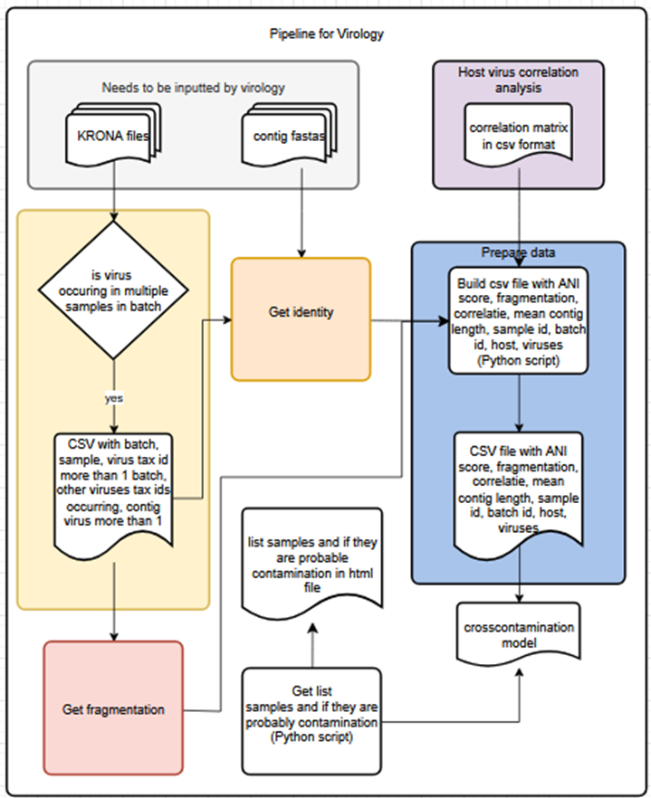

# Cross-Contamination Prediction Pipeline

This repository contains a set of Python scripts developed to detect and predict cross-contamination between  
virus samples processed in batches. The pipeline includes steps for data retrieval, processing, feature extraction, and
machine learning model training and showing the technicians the results of the prediction in a HTML file.

## Table of Contents

- [Overview](#overview)
- [Pipeline Steps](#pipeline-steps)
- [Scripts](#scripts)
- [Requirements](#requirements)
- [How to Run](#how-to-run)
---

## Overview

Contamination between virus samples in sequencing batches can lead to incorrect results and interpretations. 
This project implements a machine learning-based approach to predict such cross-contaminations using the 
features average nucleotide identity, fragmentation, host virus correlation, average contig length
and count of contigs in virus derived from sequencing data and metadata. Figure 1 outlines the steps taken in the full pipeline.


Figure 1: Pipeline for predicting cross-contamination. First real 
world sample data is gathered. This data is processed and host-virus correlations, average nucleotide
identity and fragmentation are calculated from this data. These features are prepared into test, train
and validation sets and a prediction is done and shown in a HTML file.
---

## Pipeline Steps

1. **Real world sample data** — Extraction and parsing of sample and virus data.
2. **Get host-virus correlation** — Calculation of host-virus co-occurrence.
3. **Get identity** — Calculation of ANI (Average Nucleotide Identity) scores.
4. **Get fragmentation** — Assessment of viral sequence fragmentation.
5. **Prepare data** — Merging features and labels into train/test datasets.
6. **Model for cross-contamination** — Predict contamination.
7. **show prediction** - show prediction results in HTML file.
---

## Scripts

| Script Name                           | Description                                                                            | Step Name                        | 
|---------------------------------------|----------------------------------------------------------------------------------------|----------------------------------|
| `Getting_all_contig_seqs_from_clc.py` | Retrieves contig sequences from CLC database                                           | Real world sample data           | 
| `Read_krona_files.py`                 | Extracts virus names, taxonomic rank, and contigs from Krona output                    | Real world sample data           |
| `Get_krona_info.py`                   | Extracts sample ID, host name, virus names, and contigs                                | Real world sample data           |
| `Get_contaminant_virus.py`            | Identifies potential contaminants by checking shared viruses across samples in a batch | Getting potential contaminants   |
| `Get_host_virus_correlation.py`       | Computes host-virus correlation scores across all samples                              | Get host virus correlation       |
| `Calculate_ani_score.py`              | Calculates ANI between viral sequences in different samples                            | Get identity                     | 
| `Calculate_fragmentation.py`          | Measures fragmentation of virus sequences across samples                               | Get fragmentation                |
| `Count_contigs.py`                    | Counts contigs and calculates their total length per virus per sample                  | Get fragmentation                |
| `Make_prediction_file.py`             | Merges all feature files and labels into prediction set                                | Prepare data                     |
| `Predict_contamination.py`            | Shows prediction of ensemble model on prediction set in HTML file                      | Model for cross-contamination    |

---

## Requirements

Install the required Python libraries using:

```bash
pip install -r requirements.txt
```
The pipeline relies on Python libraries including numpy, pandas, matplotlib, scikit-learn, xgboost, imbalanced-learn, 
beautifulsoup4, openpyxl and biopython.

### Required input files:
- KRONA HTML file in: 2025.molbio.008 Contaminatie vinden in virussamples met machine/test_data/data/handmade_kronas_contamination
- FASTA files in: 2025.molbio.008 Contaminatie vinden in virussamples met machine/data/testing/Databases/CLCArchive/1.Diagnostics_Collections/Virus_Viroids/
- Excel files of analysts for label determination in: 2025.molbio.008 Contaminatie vinden in virussamples met machine/test_data/data/label_data_virology/Virologie/Virologie

### Extra input files that can be used:
- Officiele logboeken virology for extra host names: 2025.molbio.008 Contaminatie vinden in virussamples met machine\test_data\data\Logboeken officiele documenten


## How to Run

1. Clone this repository:
   ```bash
   git clone https://NIVIP@dev.azure.com/NIVIP/2025.molbio.008%20Contaminatie%20vinden%20in%20virussamples%20met%20machine/_git/2025.molbio.008%20Contaminatie%20vinden%20in%20virussamples%20met%20machine
   ```

